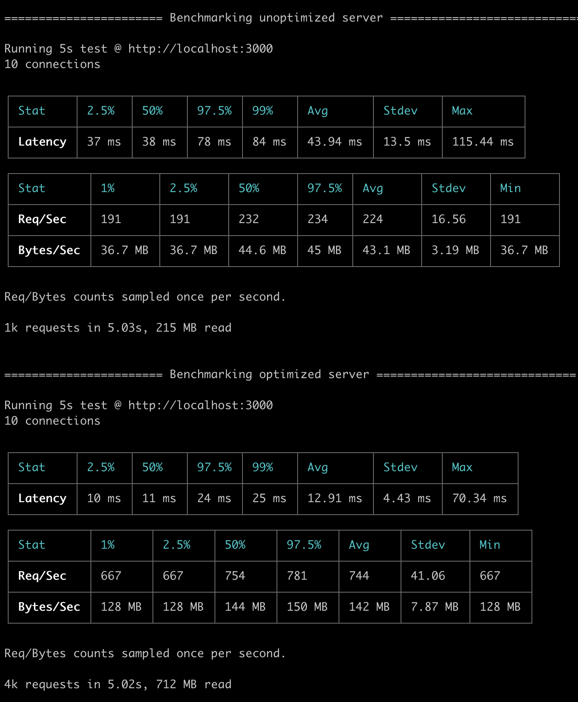

# esx-demo

A small demo of [`esx`](https://github.com/esxjs/esx) in action.


## Benchmarks

```sh
npm run bench
```

### ~330% more throughput, ~325% higher req/s, ~75% lower latency

<p align=center>
  
</p>

## About

This demo is a (very) stripped down version of [react-pwa](https://github.com/nearform/react-pwa).


## Contributions

`esx` is an **OPEN Open Source Project**. This means that:

> Individuals making significant and valuable contributions are given commit-access to the project to contribute as they see fit. This project is more like an open wiki than a standard guarded open source project.

See the [CONTRIBUTING.md](https://github.com/esxjs/esx/blob/master/CONTRIBUTING.md) file for more details.


## License

[MIT](./LICENSE)

## Sponsors

* [nearForm](https://nearform.com)